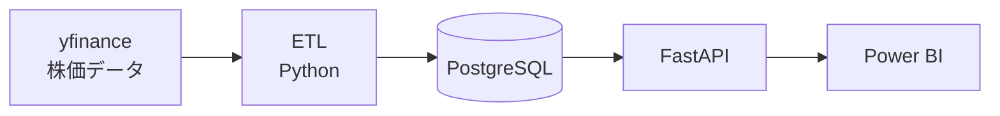

# finova — 日本株ポートフォリオ BI ダッシュボード

日本株8銘柄の株価を毎日自動で集め、「もしこの8銘柄に投資していたら、いま資産はいくらになっているか」を
ひと目で分かる画面にした BI システムです。

データの収集からデータベースへの保存、画面での可視化までを構築しました。

**想定シナリオ**: 2023年7月末に8銘柄へ100万円ずつ（計800万円）投資し、
売り買いせずに持ち続けた場合の成績を分析する。

対象銘柄: トヨタ自動車 / ソニーグループ / ソフトバンクグループ / 三菱UFJフィナンシャルG /
NTT / キーエンス / 信越化学工業 / 東京エレクトロン

---

## 画面の紹介

3ページ構成です。**銘柄や期間を画面上で選ぶと、グラフや数字がすべて連動して切り替わります。**

### Page 1. 概要 — 「全体でいくら儲かったか」


ポートフォリオ全体の成績を表示します。800万円の元本が約1,586万円（+98.3%）になったことが、
開いた瞬間に分かります。

右上のグラフは8銘柄の値上がり比較です。株価そのものは銘柄ごとに桁が違うため
（キーエンス 約84,000円、NTT 約177円）、そのまま重ねると比較になりません。
そこで**全銘柄を「開始日 = 100」に揃えて描く**ことで、「どれが何倍になったか」を
同じ土俵で比べられるようにしています。

### Page 2. 銘柄詳細 — 「この銘柄は今どういう状態か」


銘柄を1つ選んで深掘りするページです。株価のギザギザをならした**移動平均線**を
3本（1週間・1か月・3か月）重ねることで、いま上昇局面なのか下降局面なのかを判断できます。

### Page 3. セクター比較 — 「どの業種が強かったか・分散は効いているか」


業種（セクター）ごとの成績と、**銘柄どうしの値動きの連動度（相関）**を色の濃さで示した表です。

分散投資では「値動きの連動が低い銘柄の組み合わせ」ほどリスクが下がります。
この表からは、例えば同じ「通信」業種の NTT とソフトバンクGの連動度がほぼゼロ（0.08）という、
**業種の分類だけでは見えない関係**が読み取れます。

### 絞り込みの例

銘柄と期間を絞り込んだ状態。すべての数字とグラフが選択に追従します。

| 概要 | 銘柄詳細 | セクター比較 |
|---|---|---|
|  |  |  |

---

## 仕組み

データは次の流れで毎回自動的に処理されます。



1. **収集** — Yahoo Finance の株価データを Python プログラムで取得
2. **保存** — 取得したデータを整えてデータベース（PostgreSQL）に保存
3. **提供** — データベースの中身を、決まった窓口（API）を通して渡す
4. **可視化** — Power BI がその窓口からデータを受け取り、画面に描く

データベースに直接つなぐこともできますが、あえて窓口（API）を1つ挟んでいます。
将来 Web アプリなど別の画面を作るときも同じ窓口を使い回せるようにするためです。

### 使用技術

| 役割 | 技術 |
|---|---|
| データ収集 | Python / yfinance / pandas / tenacity |
| データ保存 | PostgreSQL / SQLAlchemy |
| データ提供（API） | FastAPI / Pydantic / uvicorn |
| 可視化 | Power BI Desktop / DAX |

---

## 工夫したポイント

### 「平均株価」の罠を避けた計算

「各銘柄100万円ずつ」の成績は、株価を単純に平均しても出せません。2銘柄の例で示します。

| 銘柄 | 開始時の株価 | 終了時の株価 | 上昇率 |
|---|---|---|---|
| NTT | 100円 | 200円 | **+100%** |
| キーエンス | 10,000円 | 10,000円 | **0%** |

各100万円ずつ投資したなら、NTT の分が200万円になり合計300万円。**正解は +50%** です。

ところが「平均株価の変化」で計算すると、
(100+10,000)÷2 = 5,050円 が (200+10,000)÷2 = 5,100円 になっただけなので **+0.99%** と出てしまいます。
株価の高いキーエンスに結果が支配され、NTT の値上がりがほぼ無視されるためです。

このダッシュボードでは、**銘柄ごとに成績を計算してから合計する**方式で、この問題を避けています。

### 「営業日」で数える移動平均

移動平均の「5日」を暦の5日間で数えると、土日が混ざって実際は3〜4営業日分の平均になってしまいます。
このダッシュボードでは**取引があった日だけを数えて直近5営業日を取る**方式にしており、
証券会社のチャートと同じ基準（5日・25日・75日）で表示されます。

### 見せかけの相関を排除

株価そのものどうしで連動度を計算すると、「両方とも長期的に上がっている」というだけで
高い数値が出てしまいます（見せかけの相関）。
そこで**前日からの変化率（日次リターン）**に変換してから計算し、
「今日 A が上がった日に B も上がったか」という本当の連動だけを測っています。

### 何度実行しても壊れないデータ更新

データ取得は毎回すべて洗い替えるのではなく、「既にある日付は上書き、ない日付は追加」という
方式（UPSERT）にしています。同じ処理を何回実行してもデータが重複せず、
途中で失敗してもやり直すだけで復旧できます。
また、取得失敗時は自動で再試行する仕組みを入れています。

---

## 動かしたい方へ

### 前提

- Python 3.10 以上
- PostgreSQL
- Power BI Desktop（Windows のみ・ダッシュボードを開く場合）

### 手順

```bash
# 1. 依存パッケージのインストール
pip install -r requirements.txt

# 2. PostgreSQL にデータベースを作成
createdb finova

# 3. 環境変数の設定（.env.example をコピーして値を書き換える）
cp .env.example .env

# 4. テーブル作成 + 銘柄マスタ投入
python -m etl.upsert_symbols

# 5. 株価データの取得・投入（3年分・約6,000件）
python -m etl.fetch_prices

# 6. API の起動
python -m uvicorn api.main:app --reload
```

`http://localhost:8000/docs` で API の動作を確認できます。

### ダッシュボードファイルについて

`power_bi/finova.pbix` を Power BI Desktop（無料・Windows のみ）で開くと、実際に操作できます。
**データは取り込み済みなので、そのまま閲覧できます。**

ただし「更新」を押すと `localhost:8000` へ接続しにいくため、
API を起動していない環境ではエラーになります。閲覧のみであれば更新は不要です。

---

## プロジェクト構成

```
src/
├── api/                データ提供（FastAPI）
├── common/             共通部品（DB 接続・テーブル定義・ログ）
├── etl/                データ収集・投入
├── data/               対象銘柄の定義（CSV）
├── docs/images/        ダッシュボードのスクリーンショット
└── power_bi/           ダッシュボード本体（.pbix）
```

- パスワード等の接続情報はコードに書かず、環境変数で管理しています
