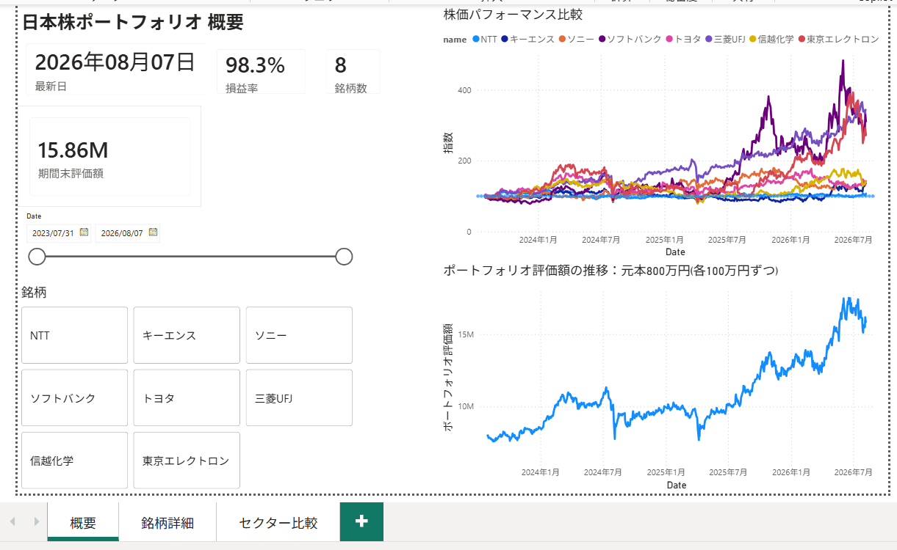
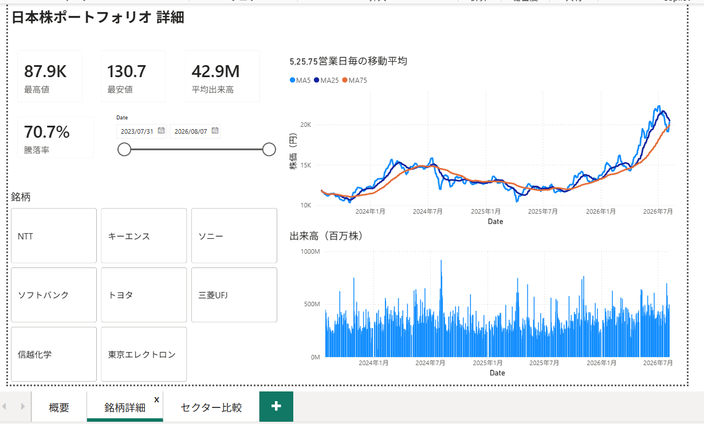
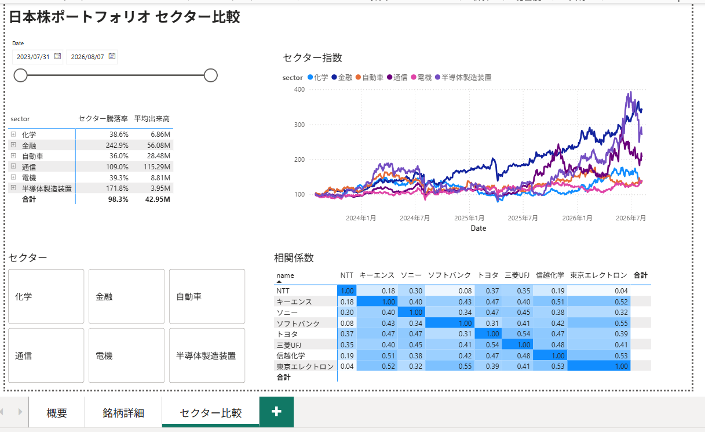
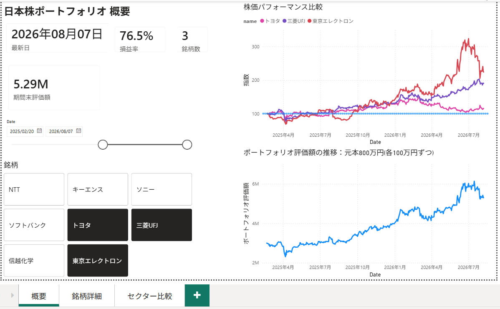
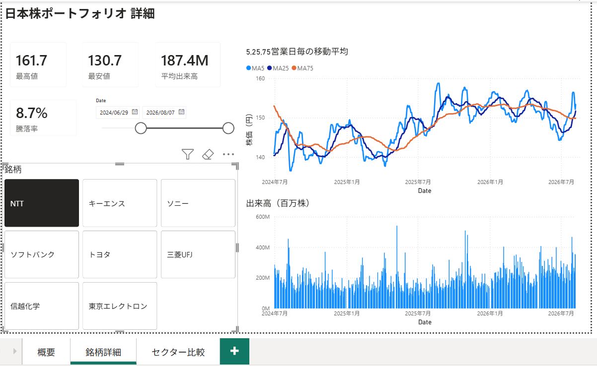
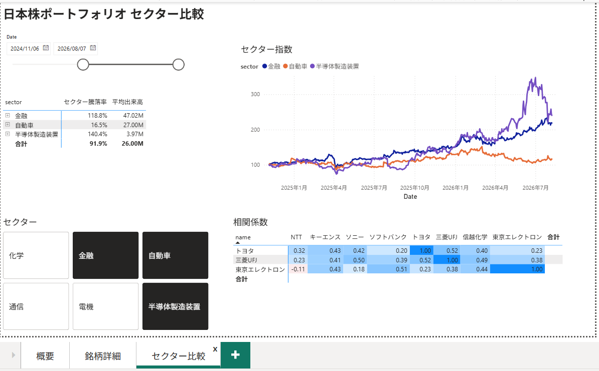
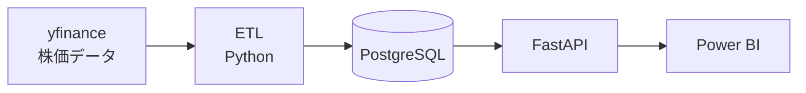

# finova — 日本株ポートフォリオ BI ダッシュボード

日本株8銘柄の株価を自動収集し、ポートフォリオのパフォーマンスを可視化する BI システムです。
**データ収集（ETL）→ データベース → API → ダッシュボード**までを一気通貫で構築しました。

**想定シナリオ**: 2023年7月末に8銘柄へ100万円ずつ（計800万円）投資し、
リバランスせずに保有し続けた場合のパフォーマンスを分析する。

対象銘柄: トヨタ自動車 / ソニーグループ / ソフトバンクグループ / 三菱UFJフィナンシャルG /
NTT / キーエンス / 信越化学工業 / 東京エレクトロン

---

## ダッシュボード

3ページ構成。**銘柄・期間のスライサーを操作すると、全ビジュアルが連動して切り替わります。**

### Page 1. 概要



ポートフォリオ全体の状況。株価水準の異なる8銘柄を「選択期間の開始日 = 100」に正規化して
重ね描きすることで、**どの銘柄がよく上がったか**を同じ土俵で比較できます。

絶対株価のまま重ねると、株価の高い銘柄（キーエンス 約84,000円）だけが上に離れ、
低い銘柄（NTT 約177円）は底に貼りついて動きが読めません。正規化はそれを解消する処理です。

### Page 2. 銘柄詳細



銘柄を1つ選び、**移動平均（5 / 25 / 75営業日）**と出来高で個別に分析します。
移動平均の並び順とクロス（ゴールデンクロス / デッドクロス）から、
いま上昇局面か下降局面かを判定できます。

### Page 3. セクター比較



セクター別のパフォーマンス推移と、**銘柄間の相関ヒートマップ**。
相関が低い組み合わせが多いほど分散が効いている、という読み方をします。

同じ「通信」セクターの NTT とソフトバンクGの相関が 0.08 しかない、といった
**セクター分類だけでは見えない関係**が可視化されます。

### スライサーによる絞り込み

銘柄と期間を絞り込んだ状態。すべてのビジュアルが連動します。

| 概要 | 銘柄詳細 | セクター比較 |
|---|---|---|
|  |  |  |

損益率は**選択した銘柄数に応じて分母が変わる**ため（1銘柄なら元本100万円、
2銘柄なら200万円）、どの絞り込み状態でも正しい率が表示されます。

---

## システム構成



Power BI から PostgreSQL に直接つなぐこともできますが、**あえて FastAPI を経由**しています。
将来 Web アプリからも同じデータを使えるようにするためと、
データの入口を1つに絞ってスキーマ変更の影響範囲を限定するためです。

### 使用技術

| 領域 | 技術 |
|---|---|
| データ収集 | Python / yfinance / pandas / tenacity |
| データベース | PostgreSQL / SQLAlchemy |
| API | FastAPI / Pydantic / uvicorn |
| 可視化 | Power BI Desktop / DAX |

### テーブル構成

| テーブル | 内容 | 主キー |
|---|---|---|
| `symbols` | 銘柄マスタ（コード・名称・セクター・有効フラグ） | `code` |
| `daily_prices` | 日次株価（始値・高値・安値・終値・出来高） | `code` + `date` |

---

## 技術的な見どころ

### スタースキーマによるデータモデル

```
symbols[code]  ──(1:*)──→  prices[code]
dim_date[Date] ──(1:*)──→  prices[date]
```

中央に実データ、周りに分析軸（銘柄・日付）を配置する BI の標準設計です。
日付テーブル（`dim_date`）は DAX の `CALENDAR` で生成しています。

株価データには**土日祝が存在しない**ため、連続した日付テーブルがないと
時系列グラフの軸が歪み、時系列関数も正しく動きません。

### 均等配分ポートフォリオの正しい計算

「各銘柄100万円ずつ」の評価額は、単純な平均では計算できません。

```dax
ポートフォリオ評価額 = SUMX(VALUES(symbols[code]), [指数] * 10000)
```

平均株価で計算すると、株価の高い銘柄（キーエンス 約84,000円）に結果が支配され、
株価の低い銘柄（NTT 約177円）が無視されます。**銘柄ごとに計算してから合計する**必要があります。

`SUMX` の中でメジャーを名前で呼ぶと自動的に `CALCULATE` で包まれ（コンテキスト遷移）、
銘柄単位の計算になります。

### 営業日ベースの移動平均

DAX の定番である `DATESINPERIOD(..., -5, DAY)` は**暦の5日間**を意味するため、
土日を含んで実質3〜4営業日の平均になってしまいます。

```dax
MA5 =
VAR CurrentDate = MAX(dim_date[Date])
VAR Last5Days =
    TOPN(5, FILTER(ALL(prices[date]), prices[date] <= CurrentDate), prices[date], DESC)
RETURN
    AVERAGEX(Last5Days, CALCULATE(AVERAGE(prices[close]), ALL(dim_date)))
```

「**範囲で切る**」のをやめて「**取引日の一覧から件数で取る**」ことで、
土日を何日跨いでも必ず5営業日になります。

### 相関ヒートマップ（切断テーブル）

マトリックスの行と列に同じ銘柄列を置くと、両方に同じフィルターが掛かって
対角線以外が空になります。**リレーションを持たない銘柄テーブルを複製**することで、
行と列で別々の銘柄を指定できるようにしました。

相関係数は DAX に `CORREL` 関数がないため、共分散 ÷ 標準偏差の積を手で実装しています。
また、終値の水準で相関を取ると「両方とも右肩上がり」というだけで 0.9 を超えてしまうため
（見せかけの相関）、**日次リターン**を計算列で持たせ、それを使っています。

### 冪等な ETL

`INSERT ... ON CONFLICT DO UPDATE`（UPSERT）により、**何度実行しても同じ結果**になります。

```python
stmt = insert(Symbol).values(rows)
stmt = stmt.on_conflict_do_update(index_elements=["code"], set_={...})
```

CSV から外れた銘柄は論理削除（`is_active=False`）し、その株価データは物理削除します。
**復元にコストがかかるもの（手入力のマスタ）は残し、再取得できるもの（株価）は消す**、
という基準で分けています。

### API URL のパラメーター化

Power Query のパラメーター（`BaseUrl`）で URL を一元管理しています。
本番環境へ移行する際は**1箇所を書き換えるだけ**で、
既存のグラフや DAX を作り直す必要がありません。

DAX メジャーの全定義と設計判断は [docs/dax_measures.md](docs/dax_measures.md) にまとめています。

---

## セットアップ

### 前提

- Python 3.10 以上
- PostgreSQL
- Power BI Desktop（Windows のみ・ダッシュボードを開く場合）

### 手順

```bash
# 1. 依存パッケージのインストール
pip install -r requirements.txt

# 2. PostgreSQL にデータベースを作成
createdb finova

# 3. 環境変数の設定（.env.example をコピーして値を書き換える）
cp .env.example .env

# 4. テーブル作成 + 銘柄マスタ投入
python -m etl.upsert_symbols

# 5. 株価データの取得・投入（3年分・約6,000件）
python -m etl.fetch_prices

# 6. API の起動
python -m uvicorn api.main:app --reload
```

`http://localhost:8000/docs` で Swagger UI が開きます。

### API エンドポイント

| メソッド | パス | 内容 |
|---|---|---|
| GET | `/health` | ヘルスチェック |
| GET | `/symbols` | 銘柄一覧 |
| GET | `/prices` | 株価データ（`code` / `start` / `end` で絞り込み可） |

---

## プロジェクト構成

```
src/
├── api/                FastAPI
│   ├── main.py         エンドポイント定義
│   └── schemas.py      レスポンススキーマ（Pydantic）
├── common/             共通部品
│   ├── db.py           DB 接続（.env から読み込み）
│   ├── models.py       テーブル定義（SQLAlchemy）
│   └── log.py          ログ設定
├── etl/                データ収集・投入
│   ├── upsert_symbols.py   銘柄マスタ同期
│   └── fetch_prices.py     株価取得
├── data/
│   └── symbols.csv     対象銘柄の定義
├── docs/
│   ├── architecture.md     構成と設計方針
│   └── dax_measures.md     DAX メジャー定義
└── power_bi/
    └── finova.pbix     ダッシュボード本体
```

---

## ダッシュボードファイルについて

`power_bi/finova.pbix` を Power BI Desktop（無料・Windows のみ）で開くと、
実際に操作できます。**データはインポート済みなので、そのまま閲覧できます。**

ただし「更新」を押すと `localhost:8000` へ接続しにいくため、
API を起動していない環境ではエラーになります。閲覧のみであれば更新は不要です。

---

## 実装上の判断

主要な設計判断とその理由は [docs/architecture.md](docs/architecture.md) に記載しています。

- 認証情報は環境変数で管理し、コードには書かない
- `sys.path.append` を使わず、正式な Python パッケージとして構成する
- 実行の起点はリポジトリルートに固定し、`-m` 形式で統一する
